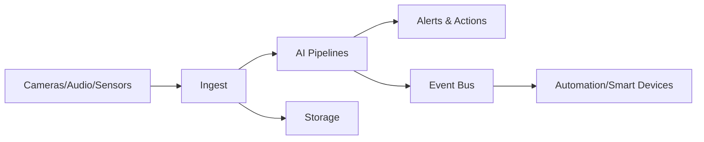

<p align="center">
  
</p>

<h1 align="center">AI‑Stalker</h1>
<h3 align="center">Blacklisted Binary Labs • Multi‑Node AI Security Orchestrator</h3>
<p align="center"><strong>Chief Developer & Designer:</strong> Rob Branting</p>

<p align="center">
  
  
  
  
</p>

> **AI‑Stalker** is the next evolution of AutoPTZ — now reborn as a **multi‑node, AI‑amplified, fail‑safe security platform**.  
> High‑energy, high‑reliability, zero‑excuses.  
> We hack the boredom out of security — **legally, ethically, and with consent**.

---

## ⚠️ Safety & Consent (Non‑Negotiable)
AI‑Stalker is for **authorized security and automation use** only.  
No unauthorized surveillance. No device hijacking. No mischief.  
If your use case needs a lawyer, it’s not welcome here.

---

## Table of Contents
1. [What AI‑Stalker Is](#what-ai-stalker-is)
2. [Current Capabilities (Today)](#current-capabilities-today)
3. [Planned Capabilities (Roadmap)](#planned-capabilities-roadmap)
4. [Feature Matrix](#feature-matrix)
5. [Architecture at a Glance](#architecture-at-a-glance)
6. [Advanced Behaviors & Protocols](#advanced-behaviors--protocols)
7. [Failover & “Next‑in‑Line” Failsafe](#failover--next-in-line-failsafe)
8. [Hive Mode & Idle Resource Pooling](#hive-mode--idle-resource-pooling)
9. [AI Engines & LLM Strategy](#ai-engines--llm-strategy)
10. [Device & Smart‑Home Integration](#device--smart-home-integration)
11. [Observability & Operations](#observability--operations)
12. [Deployment Topologies](#deployment-topologies)
13. [Installer & Service Mode](#installer--service-mode)
14. [Installation (Developer)](#installation-developer)
15. [Implementation Blueprint](#implementation-blueprint)
16. [License](#license)

---

## What AI‑Stalker Is
AI‑Stalker is a **distributed, AI‑enhanced local-first NVR + security orchestrator** that scales from a single PC into a **hardened multi‑node “security hive”**—built to keep your video and context in-house, keep your life calm, and keep contributors honest.

**Blacklisted Binary Labs** edition: local-first power, consent-first discipline, and zero paywall nonsense.

### The Blacklisted Binary Labs promise
- **100% free in all ways:** no paywalls, no forced upgrades, no “pro-only” core capability locks.
- **Local-first AI:** sensitive feeds and metadata stay on your network by default (cloud only if you explicitly choose it).
- **Consent-based engineering:** for authorized security + automation use only.
- **Auditable design:** if it matters, it’s inspectable—no “trust me” magic.

### End goals (native from our end-goals doc)
AI‑Stalker is designed to:
- Run **fully local** (offline‑first), with optional hybrid cloud AI.
- Coordinate **multiple computers** with **automatic failover** (leader/failsafe chain).
- **Pool idle compute** from secondary nodes to boost inference *only when idle*, with safe auto-retreat.
- Deliver advanced monitoring: **PTZ automation (VISCA)**, **AI tracking**, **identity workflows** (trusted/ignored + high-risk priority), and **event summarization** (who arrived/left, who they interacted with, what they brought/left with, and behavior/context tagging where feasible).
- Expand with authorized **repurposed user-owned devices** (cameras/mics today; repurposed smartphones later).
- Provide advanced resilience: **cluster health + automatic continuity** if a node goes down.

- Merge cameras, microphones, and sensors into a **single brain**.


---

## Current Capabilities (Today)
These features exist in the current codebase:

### Phase 1: Network & Discovery ✅
- ✅ **Live camera feeds** (USB, NDI, RTSP with embedded auth)
- ✅ **Network auto-discovery** (Nmap + socket probing)
- ✅ **Credential management** (CRUD operations, encrypted storage)
- ✅ **Camera registry** (SQLite persistence, health tracking)

### Phase 2: AI Setup & Tracking ✅
- ✅ **Facial recognition & tracking** (dlib + face_recognition)
- ✅ **Automated PTZ movement** via VISCA (network + USB)
- ✅ **AI setup wizard** (Claude API + MCP tools)
- ✅ **ONVIF capability probing** (auto-detect camera capabilities)
- ✅ **Sensitivity configuration** (face confidence, motion thresholds)

### Phase 3: Cloud & Failsafe ✅
- ✅ **Google OAuth 2.0** (token persistence, auto-refresh)
- ✅ **Cloud backup manager** (7 data categories, local-first)
- ✅ **Google Drive sync** (upload/download/delete backups)
- ✅ **Failsafe node** (automated backups, cloud sync scheduling)
- ✅ **Cloud settings UI** (4-tab configuration interface)

### Phase 3.5: Multi-AI Support ✅
- ✅ **OpenAI API support** (GPT-4o-mini integration)
- ✅ **Anthropic Claude** (3.5 Sonnet + MCP tools)
- ✅ **Provider auto-detection** (environment-based routing)
- ✅ **User environment files** (`~/.autoptz/.env` configuration)

### Phase 4: Event Logging & Analytics ✅ (NEW)
- ✅ **Automatic event logging** (face detections, PTZ movements, tracking state)
- ✅ **Confidence threshold enforcement** (default 0.6, configurable)
- ✅ **Smart deduplication** (prevents log spam)
- ✅ **Multi-photo user enrollment** (register one person from several photos)
- ✅ **Attendance tracking** (check-in / check-out timing with auto-checkout)
- ✅ **Event search & filters** (full-text, camera, event type)
- ✅ **Event statistics** (real-time analytics by type)
- ✅ **Enhanced recorded library UI** (split-pane details + stats)

### Infrastructure & UI ✅
- ✅ **Cross‑platform runtime** (Windows/macOS)
- ✅ **PySide6 Qt UI** (responsive grid layout)
- ✅ **QThread workers** (async operations, non-blocking)
- ✅ **Graceful degradation** (optional dependencies)

---

## Planned Capabilities (Roadmap)
These features are under active development or planned for future releases:

### Phase 5: Multi-Node & Clustering (Planned)
- 🛰️ **Failover node chain** with automatic takeover (1–60 min delay)
- 🐝 **Hive mode**: use idle computers for AI compute + storage
- 🧾 **Observability pipeline** for logs + events across all nodes
- 📊 **Cluster health monitoring** (automatic continuity)

### Phase 6: Advanced AI & Analytics (Planned)
- 🧠 **Multi‑LLM orchestration** improvements (context preservation)
- ⚡ **OpenVINO / Triton inference** for CPU‑optimized AI
- 🧩 **Pluggable AI backends** (InsightFace, OpenFace, Kornia)
- 📈 **Behavior tagging** (identity workflows, risk scoring)
- 🎬 **Video playback with timeline** (event-based scrubbing)

### Phase 7: Smart Integration & Alerts (Planned)
- 🧰 **Smart‑home device integration** (lights, locks, sensors)
- 🔔 **Event notifications** (email, push, webhooks)
- 🎯 **Advanced alert cascade** (multi-zone correlation)
- 📤 **Event export** (CSV, JSON, streaming APIs)

---

## Feature Matrix

| Category | Now | Planned | Key Differentiator |
|---|---|---|---|
| **Camera Ingest** | ✅ | ✅ | USB, NDI, RTSP with embedded auth |
| **Network Discovery** | ✅ | ✅ | Nmap + socket probing + ONVIF |
| **Facial Recognition** | ✅ | ✅ | dlib + face_recognition + tracking |
| **PTZ Control** | ✅ | ✅ | VISCA automation + AI tracking baked in |
| **Confidence Thresholds** | ✅ | ✅ | Smart filtering to reduce false positives |
| **Multi-Photo Enrollment** | ✅ | ✅ | Add several photos for one person at once |
| **Attendance Tracking** | ✅ | ✅ | Check-in / check-out timing with auto checkout |
| **Event Logging** | ✅ | ✅ | Auto-log face detections, PTZ, tracking |
| **Event Search & Analytics** | ✅ | ✅ | Full-text search + filters + statistics |
| **AI Setup Wizard** | ✅ | ✅ | MCP tools for capability discovery |
| **Multi-AI Support** | ✅ | ✅ | Claude + OpenAI (auto-detect) |
| **Cloud Backup** | ✅ | ✅ | Google Drive integration + failsafe |
| **Multi‑Node Failover** | ❌ | ✅ | "Next‑in‑Line" standby takeover |
| **Hive Compute** | ❌ | ✅ | Idle resource pooling without user disruption |
| **Smart‑Home Bridge** | ❌ | ✅ | Device‑level automation from security events |
| **Advanced Analytics** | ❌ | ✅ | Behavior tagging + risk scoring |
| **Video Playback** | ❌ | ✅ | Timeline scrubber with event markers |

---

## TODO & Development Roadmap

### ✅ Completed (Phase 1-4)
- [x] Network discovery + credential management
- [x] Facial recognition + PTZ auto-tracking
- [x] AI setup wizard (Claude + MCP)
- [x] OpenAI integration + env detection
- [x] Google OAuth + cloud backup + failsafe
- [x] Event logging + confidence thresholds
- [x] Event search/filters/statistics UI

### 🚀 Active Development (Phase 5-7)
- [ ] Multi-node failover clustering
- [ ] Hive mode (idle compute pooling)
- [ ] Observability pipeline (cross-node logs)
- [ ] Advanced behavior tagging
- [ ] Video playback with timeline
- [ ] Smart-home device integration
- [ ] Event notifications + webhooks
- [ ] Performance optimization + monitoring

### 📋 Backlog (Phase 8+)
- [ ] Microphone integration
- [ ] Advanced sensor support
- [ ] Repurposed device onboarding
- [ ] Custom AI model support
- [ ] Distributed storage (DRBD/Syncthing)
- [ ] Zero-trust networking

---

## Competitive Advantages (Why This Stands Out)
- **Local‑first AI:** keep sensitive video on your network.
- **Event-driven architecture:** automatic logging, filtering, analytics.
- **Multi-AI support:** Claude + OpenAI with auto-detection.
- **Failover baked in:** not a bolt‑on, not a manual script.
- **Hive compute:** idle machines become a privacy‑friendly AI cluster.
- **Protocol agnostic:** USB/NDI/RTSP/ONVIF with no vendor lock‑in.
- **Operator‑first UI:** built for quick response, not endless settings.
- **Ethical guardrails:** consent‑based device onboarding by design.

---

## Architecture at a Glance
```
[Cameras/Mics/Sensors]
        │
        ▼
[Ingest + Normalization] → [AI Pipelines] → [Events & Alerts]
        │                      │                │
        ▼                      ▼                ▼
     [Storage]           [LLM Orchestrator]  [Automation]

[Control Plane: Raft + Memberlist]
[Data Plane: Zenoh + NATS]
[Sync: Syncthing / DRBD]
```

### Mermaid Flow


---

## Advanced Behaviors & Protocols
AI‑Stalker is designed around **intentional, auditable behaviors** and **standard protocols**:

### Protocols (Now + Planned)
- **NDI** (live video ingest)
- **USB Video** (local devices)
- **RTSP / ONVIF** (planned for IP cameras)
- **VISCA** (PTZ control)
- **NATS / Zenoh** (event and telemetry)

### Advanced Behaviors (Planned)
- **Alert Cascade:** one sensor triggers higher sensitivity on nearby nodes.
- **Zone‑aware escalation:** raise alert thresholds based on time and location.
- **Multi‑camera correlation:** fuse detections across nodes.
- **Audio‑driven wake‑up:** trigger camera recording on sound patterns.

---

## Security & Privacy Model (Planned)
- **Consent‑based device enrollment** with explicit approval.
- **Encryption in transit and at rest** for logs, embeddings, and metadata.
- **Audit trails** for configuration and admin actions.
- **Minimal data retention** policies by default.

---

## Failover & “Next‑in‑Line” Failsafe
AI‑Stalker is built like a **relay race for reliability**:

- **Leader election** via Raft/Dragonboat
- **Membership tracking** via Memberlist gossip
- **Failover window** configurable from **1–60 minutes**
- **Config + model data sync** (Syncthing / optional DRBD)

### Failover Timeline (Planned)
1. Primary node goes offline (unexpected shutdown).
2. Cluster detects missing heartbeat.
3. Next node enters **standby‑promotion** state.
4. VIP/DNS takeover, services resume.
5. No manual reconfiguration required.

---

## Hive Mode & Idle Resource Pooling
AI‑Stalker can **borrow idle machines** like a polite vampire:

- ✅ **Idle detection** via CPU + input activity thresholds
- ✅ **Auto‑retreat** when users return
- ✅ **Compute pooling** for AI inference
- ✅ **Storage pooling** for redundancy

---

## AI Engines & LLM Strategy
**Local‑first, cloud‑optional**:

- **OpenVINO** for CPU‑optimized inference
- **Triton Inference Server** for multi‑model hosting
- **InsightFace/OpenFace** for face embeddings
- **Kornia (Rust)** for accelerated CV filters

**LLM routing policies**:
- Local model by default
- Cloud only if explicitly allowed
- Policy‑driven token budgeting + privacy constraints

---

## Device & Smart‑Home Integration
AI‑Stalker turns your environment into a **coordinated defense system**:

- **Home Assistant** bridge for smart devices
- **Zigbee** support via zigpy (optional)
- **Audio alerts** with Rhasspy
- **Device onboarding** only with explicit user authorization

---

## Observability & Operations
Because invisible problems are the worst kind:

- **Netdata** for live node performance
- **Vector** for log pipelines
- **NATS** for alert delivery guarantees

---

## Deployment Topologies
**1) Solo Node:** one PC, all features local.  
**2) Primary + Failsafe:** a standby node that takes over on outage.  
**3) Hive Cluster:** multiple nodes, pooled compute, shared storage.  

---

## Configuration & Profiles (Planned)
- **Role profiles:** primary, failsafe, hive worker.
- **Device profiles:** camera/mic/sensor templates.
- **Policy profiles:** privacy, retention, AI routing.
- **Idle policies:** thresholds for compute lending.

---

## Installer & Service Mode
A Windows installer blueprint is provided at:  
`installer/windows/ai-stalker.iss`

Planned installer features:
- **32/64‑bit unified setup**
- **Service installation** (runs without user login)
- **Failsafe node configuration** during setup
- **Desktop icon + auto‑start** options

---

## Installation (Developer)
> AI‑Stalker builds on the current AutoPTZ codebase.

### Requirements
- Python 3.7+
- Windows or macOS (Linux is untested but likely viable)

### Setup
```bash
pip install cmake
pip install dlib
pip install -r requirements.txt
python startup.py
```

---

## Implementation Blueprint
For the full technical roadmap, see:  
**[AI_STALKER_IMPLEMENTATION_BLUEPRINT.md](AI_STALKER_IMPLEMENTATION_BLUEPRINT.md)**

---

## FAQ (Short and Brutally Honest)
**Q: Is this a stalker tool?**  
A: No. The name is branding. The product is for lawful, consent‑based security.

**Q: Can it run without the cloud?**  
A: That’s the goal. Local inference is the priority.

**Q: Will it run as a Windows service?**  
A: The installer blueprint includes service mode.

---

## License
See [LICENSE.md](LICENSE.md).

---

### Final Note (from Blacklisted Binary Labs)
We don’t do evil. We do **engineering**.  
We don’t stalk people. We **protect spaces**.  
We don’t cheat the system. We **out‑design it**.  
We wear black because it hides the coffee stains — not because we’re the villains.
